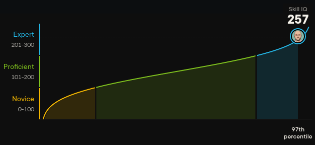



## Senior Software Engineer (working remotely)

I'm a Senior Software Engineer specialized in **Golang**, distributed systems and highly scalable Microservices in the Cloud.
I've also had an extensive experience with **Kubernetes**, **SQL** and **NoSQL** databases and several messaging systems 
(i.e. **Apache Kafka**, **ApachePulsar**, **VerneMQ** and **RabbitMQ**).

I worked with both Event based systems (e.g. Event Sourcing) and traditional systems. Microservices patterns like CQRS,
Event Sourcing, Orchestration/Choreography and Sagas are my bread and butter.

I'm a strong believer of Infrastructure as Code, and I'm a DevOps at heart. I also believe that CI/CD pipelines are 
really important for developers productivity and a crucial part of any serious software company pipeline.

I always strive to follow best coding practices. Good quality, speed, latency, scalability and test coverage are all
things that I strive for (and remember to test against unexpected inputs too!).

If you want to start a conversation feel free to drop me a message on LinkedIn (or an e-mail).

* [LinkedIn](https://www.linkedin.com/in/casulafrancesco)
* [StackOverflow](http://stackoverflow.com/users/828366/francesco-casula?tab=profile)
* [GitHub profile](https://github.com/fracasula)
* [Twitter](https://twitter.com/fra_casula) 

## OpenSource contributions
* [Eclipse Paho MQTT client - Manual acknowledgments](https://github.com/eclipse/paho.golang/pull/57)
  * New feature! 
* [Eclipse Paho MQTT client - In-order routing and late ack](https://github.com/eclipse/paho.golang/pull/52)
  * The client wasn't following the MQTT protocol specifications
  * The client was sending acknowledgments right away leading to message loss in some cases
* [Eclipse Paho MQTT client - Deadlock + minor bugfixes](https://github.com/eclipse/paho.golang/pull/56)
* [Eclipse Paho MQTT client - panic: send on closed channel](https://github.com/eclipse/paho.golang/pull/58)

## Skills
* Golang [PluralSight IQ assessment (257 Expert)](https://app.pluralsight.com/score/redir/16cadbd0-5c5e-4069-bb5c-d904e38e4e2d?8b6e99bbce)
* Distributed Systems at scale
* Microservices patterns
* Kubernetes (mostly on GCP)
* SQL databases (CockroachDB, MySQL [InnoDB, MyISAM, Partitions], PostgreSQL)
* NoSQL (primarily MongoDB)
* Messaging systems (primarily Apache Kafka, Apache Pulsar and VerneMQ)
* DevOps (IaC [helm], CI/CD...)
* RESTful APIs or GraphQL
* SOLID principles
* Linux (OpenSuse Tumbleweed FTW!)
* [Computer Networking](https://www.coursera.org/account/accomplishments/verify/XUZUL29VTNZT)

## Some StackOverflow answers
* [Node.js promises](https://stackoverflow.com/questions/29185579/node-js-promises-push-to-array-asynchronously-save/44726560#44726560)
* [PHP memory profiling](http://stackoverflow.com/questions/880458/php-memory-profiling/23779807#23779807)
* [How to profile forked process](http://stackoverflow.com/questions/16787462/php-xdebug-how-to-profile-forked-process/31388948#31388948)
* [The Doctrine EntityManager is closed](http://stackoverflow.com/questions/14258591/the-entitymanager-is-closed/31112759#31112759)
* [Code review](http://codereview.stackexchange.com/questions/121003/xml-parser-using-php/121210#121210)
* [Another code review](http://codereview.stackexchange.com/questions/98225/calculator-and-formatter-classes/98226#98226)
* [MySQL partitioning](http://dba.stackexchange.com/questions/65665/partition-by-year-and-sub-partition-by-month-mysql/117438#117438)
* [PHP nested foreach with iterators](http://stackoverflow.com/questions/3405476/nested-foreach-with-iterator-interface/33416929#33416929)

[Hire me](mailto:fra.casula@gmail.com)!
